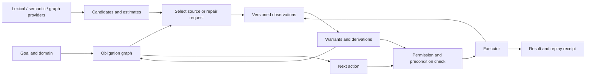

# Backbone engineering v1: operational state, evidence, obligations, and action

Date: 2026-10-01. Status: DESIGN READY; implementation is the next work item.

## 1. Decision and first executable target

Build a **task-local typed evidence and obligation engine**, with a learned proposal front and a deterministic planning/execution kernel.

Its central loop is:

```text
goal + domain + existing task permission
    -> observe versioned resources
    -> propose candidates and expose uncertainties
    -> construct the goal's fact/obligation graph
    -> derive warranted facts and feasible next steps
    -> acquire one useful missing input or execute one permitted action
    -> validate the actual outcome, update state, repeat
    -> result + unresolved obligations + replay receipt
```

The first application is **Phoenix evidence collection**: search local material, read versioned source spans, assemble a source-backed evidence packet, and prepare a note patch. It may attach proposed semantic relationships as explicitly marked candidates. It does not have to solve arbitrary semantic truth before doing useful retrieval or preparing a draft. Committing the patch uses the existing task grant and the note's expected revision; it does not introduce a new approval when the user has already authorized the operation.

The first kernel also has a tiny structured relocation/activation adapter as a software fixture. This exercises action composition and missing-precondition repair against explicit state transitions; it is not another BANK training/evaluation campaign.

The graph has four concrete jobs: **compose dependencies, compute feasible action sequences, name missing obligations, and invalidate downstream warrants after change**. Neural graph scores help nominate or rank candidates. They do not need to become portable authority probabilities for these jobs to work.

The design is new engineering work. It does not amend an experimental lock, reopen H2, promote a stopped transport gate, or claim VCS-1b was earned.

## 2. What we are using, and what kind of knowledge it is

### 2.1 Project measurements: bounded empirical constraints

| Existing result | Design consequence | Claim we do not inherit |
| --- | --- | --- |
| BANK-v1's broad policy/controller path did not become a useful general action machine; action safety and renderer transfer remained weak. | Action proposals need explicit domain preconditions and execution checks. | A learned route tuple is a generally reliable policy. |
| Edge-existence ranking survived specialization and attention-group removal better than route coordinates. | Keep it as a candidate/ranking provider with its actual bundle identity. | A stable ranking supplies a portable probability or assertion threshold. |
| NER/NLI adaptation frequently rotated observer coordinates while same-family refits recovered capability. | Backbone, tokenizer, serialization, surface, scaler, head, and calibration travel as one bundle. | A classifier can be swapped independently of its representation. |
| X0 exercised planning and repair on a supplied graph. | Reuse the explicit transition/dependency abstraction. | Oracle materialization has been solved. |
| X1's structural merger did not beat a calibrated flat merger at matched harm/coverage. | Candidate arbitration remains a separate flat/ranking service. | Graph topology magically validates correlated model proposals. |
| X6-A's acquisition benefit was substantially schema-completeness benefit. | Request missing task slots directly; the graph composes these slots across alternatives. | We demonstrated a generally optimal graph information policy. |
| R2a produced actual estimator artifacts for evidence/missing counts, with renderer limitations and a 0/1 missing-count panel. | Optional scheduling hints, emitted as estimates with provenance. | An estimated count identifies which precondition is missing. |
| VCS-0c's corrected four-cell result is substrate/population dependent; neither primary operational reconstruction cleared the oracle-gap gate. | Geometry is advisory, not the first authorization mechanism. | VCS-1b or an operational vector-region controller was earned. |

The corrected VCS ledger is authoritative. We use these findings to choose a construction, rather than converting every negative result into another mandatory probe.

### 2.2 Established methods: borrow the operations, retain their assumptions

The source register is in [SOURCES.md](SOURCES.md). The core borrowings are:

| Method | Operation adopted | Assumption boundary |
| --- | --- | --- |
| [STRIPS](https://cs.uky.edu/~sgware/reading/papers/fikes1972strips.pdf) and [heuristic planning](https://www.cs.toronto.edu/~sheila/2542/s14/A1/bonetgeffner-heusearch-aij01.pdf) | Typed action preconditions/effects; bounded cost search; optional delete-relaxed lower bounds. | The domain transition model must describe the actions being executed. Classical closed-world semantics do not describe our incomplete observations. |
| [PDDLStream](https://arxiv.org/abs/1802.08705) | Declare what external procedures accept and can supply; request relevant procedures while planning. | A procedure's certified facts require a sound procedure. A neural candidate is not a certified stream fact. Our versioned observations also differ from immutable stream facts. |
| [Truth maintenance](https://dspace.mit.edu/entities/publication/e274a3b1-dcb7-4d62-abe7-a4b0db173191) and [provenance semirings](https://www.cs.ucdavis.edu/~green/papers/pods07.pdf) | Record alternative justifications and their premises; invalidate dependent conclusions. | Provenance identifies derivation and shared sources; it is not automatically a probability calculus. |
| [Reciprocal rank fusion](https://cormack.uwaterloo.ca/cormacksigir09-rrf.pdf) | Combine heterogeneous nomination rankings without inventing score calibration. | A retrieval ordering is not evidence that a proposition is true. |
| [Shielding](https://arxiv.org/abs/1708.08611) | Separate useful proposal selection from a deterministic permission/precondition monitor. | Formal guarantees depend on the specification, abstraction, and observation assumptions. A local warrant does not certify the external world. |
| [Adaptive submodularity](https://arxiv.org/abs/1003.3967) | A possible later cost-aware acquisition policy when its diminishing-returns assumptions hold. | Our first obligation utility is not assumed submodular; complementarities and contradictions can break that property. |
| [POMDPs](https://www.sciencedirect.com/science/article/pii/S000437029800023X) | A precise later model when uncertain outcomes justify belief-state planning. | Requires transition/observation distributions and an objective worth their computational cost. |

We can implement these operations without reproducing every paper. Checking whether the stated assumptions fit the domain is part of the design.

### 2.3 Engineering assumptions for v0.1

1. Each task is given a finite typed domain slice, explicit goal, action schemas, and bounded resources. The kernel does not infer its own legal-action specification from evaluation labels.
2. Source readers and transaction executors can bind outputs to resource revisions. Permission and revision checks are authoritative for those resources.
3. A provider declares its observation scope. Search top-k results are incomplete; a bounded empty search is not proof that no source exists.
4. Deterministic facts are admitted under explicit source/predicate contracts. Semantic model outputs can remain usable proposals or estimates without being relabeled as facts.
5. Execution may fail or the environment may change. Predicted action effects are planning hypotheses until actual execution receipts confirm the outcome.
6. The initial domain uses bounded-arity predicates and bounded, function-free rules. Domain extensions are versioned independently of model bundles.
7. Success is task-relative: useful collected evidence, valid provenance, explicit unresolved needs, and correct resource operations. An evidence packet is not a proof that every underlying claim is true.

These are visible construction assumptions, not new scientific findings.

## 3. Deferred ideas recovered and given a disposition

| Deferred idea | Place in the machine now |
| --- | --- |
| Operational state rather than a latent embedding as the whole controller state | Build immediately: a versioned evidence ledger, task state, obligations, grants, and budget. |
| Typed state/action/goal/requirement graph | Build immediately: goal regression, AND/OR dependencies, bounded action search. |
| Provider contracts and missing-slot acquisition | Build immediately: typed capabilities, explicit completeness, cost, retries, and requests. |
| Observer bundle ABI and lifecycle | Build immediately: verified immutable bundle references; whole-bundle compatibility checks. |
| R2a evidence/missing-count estimates | Optional advisory fields after the basic loop runs; no dependency of first action authorization. |
| Graph edge residual, structural pruning, and learned link ranking | Candidate-front adapter. Preserve supported endpoint types and original retrieval candidates; expose scores as rankings. |
| NBFNet query-conditioned graph traversal | Preferred later learned relational provider when multi-hop candidate nomination is a measured product bottleneck. Its interface is defined now. |
| CompGCN, StarE, ULTRA, temporal graph methods | Concrete alternatives for that provider, selected by topology/qualifier/vocabulary/time requirements, not by copied leaderboard scores. |
| Pairwise lexical compatibility | A directed, context-local transport adapter. No named phenotype requirement and no assumed transitive closure. |
| Adaptive memory and proposal queue | Store proposals and review disposition separately from admitted facts; reuse only within compatible scope and bundle versions. |
| Cross-surface coordination | A provider can emit from an already validated surface. Agreement is provenance, not presumed independent corroboration. |
| Attention/head archaeology | Closed; not a build dependency. |

The implementation does not wait for a universal graph model, another surface census, new human labels, or a geometry rescue.

## 4. Mathematical objects

### 4.1 Domain and observable state

Define a domain contract

\[
\mathcal D=(\mathcal T,\mathcal P,\mathcal R,\mathcal A,\mathcal I,\mathcal C).
\]

Here \(\mathcal T\) is the type system, \(\mathcal P\) the predicate signatures, \(\mathcal R\) the derivation rules, \(\mathcal A\) the action schemas, \(\mathcal I\) the invariants, and \(\mathcal C\) the source/provider/admission contracts. Each predicate declares argument roles, direction, scope, temporal behavior, and any functional constraints.

The runtime state is

\[
S_t=(\mathcal D,v_t,U_t,E_t,C_t,M_t,G_t,O_t,\Gamma_t,B_t,J_t).
\]

- \(v_t\): task snapshot and resource-version vector.
- \(U_t\): typed entities actually introduced to this task.
- \(E_t\): observations with source spans, revisions, and provenance.
- \(C_t\): proposed entities/edges/plans; kept separate from observations.
- \(M_t\): model estimates and uninterpreted ranking scores.
- \(G_t\): explicit task goal.
- \(O_t\): current obligation graph.
- \(\Gamma_t\): applicable task grants and executor capabilities.
- \(B_t\): remaining time, calls, bytes, search nodes, and memory budget.
- \(J_t\): justification/proof graph over active evidence.

The actual world \(W_t\) is not a field the runtime gets for free. It may supply observations through providers. Training/evaluation labels are not part of \(S_t\). A named source fact, an estimated count, and a hidden world truth are distinct objects.

### 4.2 Facts, scope, contradiction, and absence

A grounded atom is

\[
p=(predicate,arguments,scope,validity).
\]

An observation has the form

\[
e=(p,polarity,source,revision,span,producer,contract,observed\_at,expiry).
\]

Polarity is explicit support or explicit refutation. For one atom, raw eligible evidence gives the pair

\[
K_t(p)=(\mathbf1[\text{support exists}],\mathbf1[\text{refutation exists}]).
\]

The four states are **UNOBSERVED**, **SUPPORTED**, **REFUTED**, and **CONFLICTED**. A timeout adds no polarity. A model abstention adds no polarity. Opposite propositions do not explode into arbitrary conclusions.

Negative preconditions require an explicit negative warrant. They may also be established by an exact, scoped completeness certificate: for example, a complete enumeration of one immutable collection can warrant the absence of a member within that collection and revision. A top-k retrieval result or a missing model edge cannot do this.

Functional constraints are separate from explicit negation. Two different current locations for one object conflict if the domain declares location functional. Two quotes about different times need not conflict. Relation direction and source qualifiers remain part of the atom identity.

### 4.3 Derivation and justified execution premises

Use signed, positive Horn clauses for the initial rule language:

\[
\ell_1\land\cdots\land\ell_k\rightarrow\ell,
\]

where a literal can be a positive or explicitly negative atom. There is no negation-as-failure rule in the first implementation.

To make conflict propagation precise, use a conservative two-pass construction on a finite grounded slice:

1. Compute the least derivable closure \(D_t^*\) from eligible source literals using \(\mathcal R\).
2. Mark atoms whose two signs occur in \(D_t^*\), plus atoms involved in violated declared functional constraints, as conflicted.
3. Recompute a warranted closure \(A_t^*\), starting from unconflicted eligible source literals and permitting a rule only when all premises are warranted and its conclusion is unconflicted.

Define \(holds_t(\ell)\iff\ell\in A_t^*\). An independent valid derivation can survive loss of another derivation. Cyclic rules cannot justify themselves without a grounded source path. This conservative conflict rule can withhold useful conclusions; that is an explicit engineering trade-off, not a claim of maximal paraconsistent inference.

Keep justifications factorized:

\[
J(\ell)=\bigvee_{d\in derivations(\ell)}\bigwedge_{x\in premises(d)}J(x).
\]

AND means every premise is needed; OR means an alternative justification is available. Store a shared graph of these dependencies, not an expanded polynomial or every possible path. Repeated use of the same evidence ID does not create additional independent support. This uses the provenance idea without treating products of confidence scores as probabilities.

When evidence expires or a source revision changes, remove the affected eligibility and recompute the bounded task closure first. Reverse dependency indexes make targeted invalidation available; a fully incremental engine is an optimization, not a prerequisite.

### 4.4 Provider contracts

Represent a provider contract as

\[
\Pi=(InputTypes,Domain,OutputKinds,Scope,Completeness,Cost,Validity,Identity).
\]

`Domain` says which requests are legal. `OutputKinds` separates observations, proposals, estimates, and unavailability. `Completeness` says what was exhaustively checked, if anything. `Identity` binds provider binary/configuration and any complete observer bundle.

Allowed responses are:

```text
OBSERVATION       explicit signed assertion + source/revision contract
PROPOSAL          candidate + rank/score + model/source provenance
ESTIMATE          typed estimate + frozen estimator identity
COMPLETE_EMPTY    exact empty result + scoped completeness certificate
UNKNOWN          insufficient input / timeout / incomplete response
UNSUPPORTED      capability is unavailable for this request
```

The runtime verifies contract, type, task scope, versions, applicability, and provenance before admitting any response. A verified byte-span reader can establish `ExcerptBytesMatch`; it cannot automatically establish that the excerpt entails an arbitrary semantic claim. A learned entity or edge provider can nominate that claim and expose its source span.

PDDLStream supplies a useful declarative procedure pattern. We explicitly do not inherit its soundness/completeness results for approximate, mutable, or bounded providers.

### 4.5 Actions, plans, and execution

An action schema is

\[
a=(parameters,preconditions,effects,read\_set,write\_set,cost,permission,executor).
\]

All preconditions are typed signed literals or explicit permission/resource checks. In a deterministic planning model, a complete state transition has the familiar form

\[
T(X,a)=(X\setminus Del(a))\cup Add(a).
\]

This is a model used for search. Runtime evidence is updated from the executor's actual response, not by declaring every planned effect to be observed truth.

A proposed sequence \(\pi=(a_1,\ldots,a_m)\) is checked stepwise under the domain model. Only the next step receives an execution permit. Future steps are revalidated after each outcome and any revision change.

The initial planner uses bounded uniform-cost search over the known executable state slice, stable ID tie-breaking, and nonnegative integer costs. Start with \(h=0\). When larger domains need it, add a delete-relaxed \(h_{max}\) bound only for action fragments meeting its assumptions; unknown observations never become free certified facts to make the bound look attractive.

Three search outcomes are distinct:

```text
PLAN_FOUND
NO_PLAN_IN_COMPLETE_REGISTERED_MODEL
BUDGET_EXHAUSTED / INCOMPLETE_DOMAIN
```

The last result is not `IMPOSSIBLE_GOAL`. The engine can also return a repairable frontier: a proposed plan skeleton with unresolved preconditions, explicitly non-executable until those obligations are satisfied.

### 4.6 Obligation repair

For goal \(g\), regress through declared actions, derivation rules, and providers. Create a typed AND/OR hypergraph:

- AND node: all prerequisites for this action or derivation.
- OR node: alternative actions, sources, derivations, or providers.
- Leaf: a grounded literal, resource check, provider request, or unavailable capability.

Cycles are recorded as bounded search problems, not silently flattened into a tree. A graph of dependencies can have useful shared subgoals even when lexical compatibility is non-transitive.

Each obligation receives one status:

```text
SATISFIED
KNOWN_OPPOSITION
CONFLICTED
OPEN_REQUESTABLE
OPEN_UNAVAILABLE
BUDGET_LIMITED
```

`KNOWN_OPPOSITION` can require an action that changes the state; it is not automatically terminal. `OPEN_REQUESTABLE` needs an actual provider capability and a legal request. A numerical missing-count estimate does not supply either the literal identity or a repair action.

For a plan skeleton \(\pi\), compute its unresolved set \(R_t(\pi)\). Deduplicate shared obligations by full scoped identity. The first engine ranks skeletons by executable progress, repair cost, action cost, and stable IDs. It returns one next operation, not an assumed optimal contingent policy.

### 4.7 Acquisition

Let \(Q_t\) be the legal requests capable of supplying at least one open, task-relevant obligation. The first acquisition policy prioritizes a request on the cheapest viable repair path, then favors requests shared by several remaining paths, then breaks ties by provider/request ID.

A concrete ranking is

\[
priority(q)=\frac{\sum_{o\in advertised(q)\cap frontier}w_o}{c_q+\lambda\tau_q+\epsilon}.
\]

Weights are fixed domain priorities, \(c_q\) is declared cost, and \(\tau_q\) declared latency. Advertised coverage is **potential coverage**, not a guaranteed successful answer. This is a heuristic; no submodularity or optimality guarantee is asserted. Requests that time out or repeat an unchanged empty result are recorded and cannot consume an unbounded retry loop.

The more ambitious alternative would use expected decision value:

\[
VOI(q)=\mathbb E_y[V(S_t\oplus y)]-V(S_t)-cost(q).
\]

That requires a usable outcome model and utility. We implement the obligation policy now and introduce VOI or belief-state planning only if actual request choices leave material task value on the table.

### 4.8 Authority and limits of the guarantee

An execution permit is issued only when

\[
Permit(a,S_t)=Grant(a,\Gamma_t)\land Current(v_t,read\_set(a))
\land Invariants(S_t,a)\land Budget(S_t,a)
\land\bigwedge_{\ell\in Pre(a)}holds_t(\ell).
\]

For an advisory action such as attaching a **candidate**, the precondition is that its proposal provenance and source integrity are valid. It need not pretend the proposed semantic relationship is an admitted fact. Higher-impact actions have stronger domain-specific preconditions. This keeps a useful approximate machine possible without laundering its estimates.

The permit binds the action digest, domain/policy version, snapshot/revision vector, selected warrant graph, request/grant scope, and idempotency key. The executor checks current revisions atomically with mutation. A preflight check alone is insufficient to prevent a time-of-check/time-of-use error.

Conditional guarantee: if source contracts supply correct predicates and the action model/invariants correctly describe the executor, then a permitted action satisfies those declared preconditions at the checked version. This does not prove model proposals correct, sensor contracts infallible, or the domain specification complete.

Keep familiar dispositions at the boundary: `EXECUTE`, `ASK`, `ESCALATE`, `DECLINE_UNAVAILABLE`, `NOOP`. Add explicit `BUDGET_EXHAUSTED` as a stop reason. `ASK` comes from a missing requestable obligation, not a universal learned ASK classifier. A source/provider request may satisfy it automatically; user interruption is reserved for information or permission the machine genuinely cannot obtain.

### 4.9 Objective, finite construction, and proof obligations

Each domain supplies two separate functions: `goal_check(S, output)` for its declared structural completion conditions, and `utility(output)` for usefulness. A packet can be structurally valid while being semantically unhelpful; both are reported. Satisfying the byte/provenance contract does not silently satisfy a relevance or truth target.

The intended engineering optimization is

\[
\min_{\pi}\;\mathbb E\!\left[C_{requests}(\pi)+C_{actions}(\pi)
+\lambda\sum_{o\in unresolved(\pi)}w_o\right]
\quad\text{subject to permits, invariants, and resource bounds.}
\]

The expectation describes the desired problem, not a calibrated model we already possess. The first implementation approximates it by known action costs and the declared repair heuristic. Domain contracts determine which effects are permissible; empirical task utility determines whether the selected permissible actions are worth doing.

The construction needs three small proof obligations, followed by executable tests:

1. **Grounded warrant induction:** source premises are eligible; each rule preserves the domain predicate meaning; every accepted derived premise has a grounded, unconflicted derivation. Under source/rule soundness assumptions, accepted premises are sound within their scope.
2. **Versioned action induction:** the first action is permitted at the executor's checked revision; each subsequent action is permitted against the confirmed successor state. Planned future effects cannot bypass that induction.
3. **Bounded progress:** each iteration performs an execution/request event, consumes a bounded retry/search budget, or terminates with a recorded disposition. Empty results cannot create an infinite acquisition cycle.

Ground only the typed entities and clauses reachable from this task's declared goal/provider slice. For a finite propositional clause set, queue-based closure maintains counters for outstanding premises and touches indexed body occurrences, rather than repeatedly scanning every clause. Typed joins and entity introduction have explicit bounds; discovering another object expands the slice only within budget.

Planning remains exponential in the worst case: branching factor \(b\) and depth bound \(H\) can require \(O(b^H)\) search nodes. The implementation therefore caps grounded literals, clause instances, frontier/search nodes, requests, bytes, and elapsed time. These are ordinary versioned runtime settings, not research gates. The first evidence workflow is mostly a small dependency DAG; the exact-search fixture checks the harder state-transition path.

## 5. The learned graph front has an actual interface

Maintain three connected views over shared IDs:

1. **Evidence graph:** scoped assertions, contradictions, source spans, and warrants.
2. **Obligation graph:** goal/action/provider dependency hyperedges.
3. **Proposal graph:** uncertain entity/link candidates and nomination rankings.

These are different record kinds, not three duplicated stores. A candidate can be connected to its source and target obligation without being admitted as the edge it proposes.



The learned relational interface is:

```text
nominate(snapshot, typed_query, visible_support_graph, candidate_bound)
    -> ordered candidates + supporting source IDs + representation/bundle ID
```

It can change which source, neighbor, or relation the engine investigates next. Deterministic topology and predicate checks can remove type-invalid candidates. Original lexical retrieval remains a union member; uncertain graph pruning cannot erase the only baseline route to a relevant document.

For heterogeneous nomination lists, the initial optional fusion is

\[
rankscore(x)=\sum_p\frac{1}{60+rank_p(x)},
\]

with absent entries contributing zero and stable-ID tie-breaking. The constant is an engineering default. This uses ranks, not presumed probability calibration; repeated producer ancestry is recorded and not counted as independent evidence.

The preferred new learned graph construction, **when needed**, is NBFNet-style query-conditioned propagation over the already visible sparse graph. For a query \(q\):

\[
h_v^{k+1}=Agg\left(Indicator(v,q),\{Message(h_u^k,r,q):(u,r,v)\in E_{visible}\}\right).
\]

One propagation scores a bounded candidate neighborhood; typed query grouping avoids rerunning it per triple. Fused aggregation avoids an edge-by-hidden-width message arena. Path scores nominate candidates; only separately warranted source assertions enter executable-state closure. This is an engineering adoption of the [NBFNet](https://arxiv.org/abs/2106.06935) pattern, not a claim that a learned path is a logical proof.

Use the other recovered literature for specific construction needs:

| Need | Construction | Trade-off |
| --- | --- | --- |
| Reusable typed entity/relation encodings | [CompGCN](https://arxiv.org/abs/1911.03082) composition | Cheaper reusable embeddings; domain-specific topology/vocabulary fit still matters. |
| Statement qualifiers, validity, source context | [StarE](https://aclanthology.org/2020.emnlp-main.596/) representation pattern | Preserve primary triple and qualifier roles; do not flatten source/time qualifiers away. |
| Unseen relation vocabularies | [ULTRA](https://arxiv.org/abs/2310.04562) relation-interaction graph | Additional relation-level propagation; transferable link ranking is not executable semantics. |
| Temporal nominations | [TGB 2.0](https://arxiv.org/abs/2406.09639) visibility/evaluation discipline | Strict as-of support, no future-edge or auxiliary-source leakage. |
| Temporal qualifiers | [HypeTKG](https://aclanthology.org/2024.findings-emnlp.20/) data structure | Its interpolation task does not establish future forecasting performance. |

No new GNN training is required to build the first loop. Existing lexical/structural providers can implement this interface now. A learned graph implementation becomes a replaceable service rather than a reason to postpone state, repair, and execution.

Pairwise lexical transport similarly implements `nominate_transport(relation, nomination_context, witness_context)`. It preserves direction and `ALLOW/REFUSE/ABSTAIN`, adds transported terms alongside the original query, and keeps its existing support/promotion scope. Candidate identity may select an observer but is not local compatibility evidence. No union-find or equivalence-class closure is introduced.

## 6. Construction alternatives and selected route

| Route | Useful property | Main cost/failure mode | Decision |
| --- | --- | --- | --- |
| End-to-end action classifier | Quick proposals, low inference cost | Missing repair identities, brittle transfer, stale readout coordinates | Optional proposer only. |
| Embedding/region controller | Compact multidimensional policy | Operational oracle gap and threshold transport unresolved | Advisory interface; no dependency on VCS-1b. |
| Full POMDP/controller synthesis | Principled contingent optimization | Unavailable distributions, state explosion, model mismatch | Use only for a concrete uncertain-action domain that needs it. |
| Full neural graph backbone first | Broad relational nomination capacity | Training/runtime cost; link scores still need state contracts | Provider implementation after a demonstrated nomination need. |
| Typed task-local planning + provider requests | Executable dependencies, explicit repair, deterministic replay | Requires authored schemas and honest source contracts | **First implementation.** |

This choice deliberately concentrates custom work in the seams: observation/admission, source-scoped warrants, obligation repair, budgeted acquisition, and revision-safe action execution. We borrow search and inference operations instead of attempting to rediscover them inside one learned vector.

## 7. Runtime interfaces and data layout

`BUILD-CONTRACT.json` records the chosen modules and dependency order. The proposed Rust library is `rust-native/phoenix-backbone-v1`, initially isolated from the product workspace so unrelated product/lab work remains undisturbed. Product adapters are explicit boundaries.

```rust
// Design sketch: declarations, not a compiled implementation.
struct TaskSnapshot {
    domain: DomainId,
    revision: SnapshotRevision,
    entities: Box<[EntityRecord]>,
    literals: Box<[LiteralRecord]>,
    evidence: Box<[EvidenceRecord]>,
    candidates: Box<[CandidateRecord]>,
    estimates: Box<[EstimateRecord]>,
    adjacency: FrozenOffsets,
}

struct ProviderRequest {
    request_id: RequestId,
    task: TaskId,
    snapshot: SnapshotRevision,
    capability: CapabilityId,
    obligation: ObligationId,
    arguments: SmallVec<[EntityId; 4]>,
    budget: RequestBudget,
}

trait Provider {
    fn submit(&self, request: ProviderRequest) -> RequestTicket;
    fn drain(&self, out: &mut Vec<ProviderResponse>);
}

fn admit(snapshot: &TaskSnapshot, response: &ProviderResponse)
    -> Result<AdmissionDelta, ContractError>;
fn derive(snapshot: &TaskSnapshot, scratch: &mut Scratch) -> WarrantView;
fn next_step(state: &TaskState, scratch: &mut Scratch) -> NextStep;
fn permit(state: &TaskState, action: ActionId) -> Result<Permit, Blockers>;
fn apply_receipt(state: &mut TaskState, receipt: ExecutionReceipt)
    -> Result<RevisionDelta, ContractError>;
```

Dynamic dispatch is acceptable at the provider boundary. Derivation, adjacency traversal, set operations, planning, and permit checks use monomorphic kernels over dense records.

Use stable task-local `u32` IDs and external `u64`/hash identities, fixed-width records, offsets plus contiguous arrays, and borrowed source ranges. Keep scores/model metadata cold. `hashbrown` indexes IDs during construction; ordered publication removes hash iteration from replay semantics. `smallvec` holds small argument/precondition lists, `bumpalo` holds temporary construction data, and `bitvec` represents finite literal/status sets. `memmap2` and validated `bytemuck`/`zerocopy` layouts serve immutable source/index pages. `memchr` provides byte scanning; existing SIMD kernels serve appropriate numeric/set operations with scalar parity paths.

Allocate per task/batch and reuse scratch buffers. Do not serialize a million JSON rows or allocate a tensor message per edge in the hot loop. Use bounded channels between owned stages; parallelize independent requests/tasks, then apply recorded response events in a deterministic order. Replay uses recorded responses and event ordering, not a promise that a remote provider or GPU is bit-identical across hosts.

Snapshot format validation checks schema version, lengths, offsets, bounds, endianness, and content identity before borrowed access. A hash authenticates identity/integrity, not semantic accuracy. Use the repo's existing identities at adapter boundaries rather than converting historical artifacts to a new hash convention.

## 8. First vertical slice, with an explicit trace

### 8.1 Domain

Input: a question, a bounded list of evidence needs, source scope, task budget, and optional note target/grant. Source scope can be local notes/documents. The user or a proposer supplies needs; the domain records whether they were supplied or estimated.

Providers:

```text
LocalSearch     -> candidate documents, incomplete ranking
NoteStat        -> current note/resource revision
SourceRead      -> immutable source bytes/range with revision
SpanCheck       -> exact byte/range/hash checks
SemanticFront   -> optional entity/relation/support candidates
NoteExecutor    -> version-checked idempotent insertion, when authorized
```

Actions: `SEARCH`, `READ`, `VERIFY_SPAN`, `ATTACH_CANDIDATE`, `ASSEMBLE_PACKET`, `PREPARE_PATCH`, and `COMMIT_PATCH` under an existing applicable write grant. The first useful output is available before mutation.

A packet distinguishes exact excerpts, attributed source statements, model interpretations, contradictions, and unresolved needs. Relevance ranking influences selection; it is not renamed proof of factual truth. For v0.1, exact quoted excerpts provide a source-integrity path that does not depend on a generative entailment oracle.

### 8.2 One grounded rule and one action contract

\[
SourceExists(d,v)\land Readable(d,v)\land SpanValid(s,d,v)
\land BytesMatch(s,d,v)\rightarrow WarrantedExcerpt(s,d,v).
\]

`ATTACH_CANDIDATE(s,need)` requires that excerpt warrant, a proposal/request association with the need, and task scope. Its effect is an attributed candidate attachment, not `True(claim)`.

`COMMIT_PATCH(note,patch,v)` requires an applicable write grant, verified patch identity and target, expected document revision, and executor preconditions. The executor checks the revision atomically and reports the actual resulting revision. It is not granted merely because the planner predicted a successful insertion.

### 8.3 Trace

1. A goal needs excerpts for two topics. No sources are loaded. Both needs are `OPEN_REQUESTABLE` through `LocalSearch`.
2. The engine searches one topic, receives ranked candidates, and records that the result is incomplete. It has not proved any document relevant or any claim true.
3. It reads a selected source at revision 7. `SpanCheck` verifies a quoted byte range; the rule produces a warranted excerpt with a dependency on that exact revision.
4. It attaches the excerpt as a candidate for the topic. A semantic provider may add a proposed relation, preserving its bundle/estimate provenance.
5. The second topic returns no candidate within the bounded search. The engine may request another legal source or finish with an explicit unresolved need when budget runs out. It cannot derive source absence from top-k emptiness.
6. It assembles the packet and prepares a patch. If the target note changed to revision 8, the commit permit is stale. The executor rejects it; the engine refreshes state and rebuilds against revision 8.
7. Under an existing valid grant, the new version-checked commit emits a receipt. Replay verifies the same proposal/admission/obligation/permit chain from recorded events.

This trace exercises observation, uncertain nomination, graph derivation, repair/acquisition, useful approximate output, and real resource safety in one loop.

## 9. Dependencies and implementation order

| Work package | Concrete output | Depends on | Completion evidence |
| --- | --- | --- | --- |
| W0 contracts | Domain, literal, provider, estimate, grant, permit, receipt types; fixture schema | This design | Round-trip and invalid-layout/type/version tests. |
| W1 state/warrants | Dense task state, admission checks, two-pass closure, justification links, scoped absence | W0 | Alternative support/retraction/conflict/cycle tests against a small reference interpreter. |
| W2 obligations/search | Goal regression, AND/OR dependencies, bounded uniform-cost planner, missing-slot requests | W1 | Exact small-domain plan/cost comparison; budget exhaustion never means impossibility. |
| W3 provider loop | Request tickets, costs, retries, applicability, response ordering, acquisition ranking | W2 | Timeout/empty/unsupported/failure traces terminate and preserve polarity/scope. |
| W4 executable demo | Synthetic resource adapter plus permit/execution/replay | W3 | Positive action, missing input repair, contradiction, stale revision, idempotent retry. |
| W5 Phoenix adapter | Real local search/stat/read; packet output and note patch executor | W4 | One end-to-end useful packet; one authorized insertion; one concurrent revision rejection. |
| W6 learned front | Existing frozen edge/semantic bundle and optional R2a advisory adapter | W5 | Provider ABI compatibility and graceful model absence; no unsupported factual admission. |
| W7 product iteration | Task utility, cost/latency, failure-directed improvement | W5/W6 | Useful evidence vs baseline retrieval, correct resource effects, explicit unresolved needs. |

W0-W5 proceed without new model fitting, new labels, or scientific panel opening. W6 is an enhancement, not a blocker for W5. Synthetic traces and programmatic fixtures are valid engineering inputs throughout.

Existing pieces to adapt, without modifying their frozen source identities:

- `phoenix-agent-control`: `NoteStat`, `NoteRead`, `BlockInsert`, events, expected revision, and idempotency-key boundary already exist. Verify actual host transaction behavior when wiring the executor.
- `phoenix-memory-contract`: evidence spans, semantic candidates, producer capabilities, validity/supersession records. Add a versioned adapter rather than changing archived record meaning.
- `phoenix-analysis-contract`: verified immutable artifact loading conventions.
- `phoenix-lexical-qps`: baseline candidate retrieval and bounded query behavior, kept available.
- `graph-model`: rendering adapter only where appropriate; its visual graph is not automatically the operational fact graph.
- Existing isolated Candle CPU runtime: possible numeric readout service; no new tensor framework decision for the deterministic kernel.
- VCS/C0 interfaces: borrow disposition/envelope concepts through a new engineering adapter; do not edit their experiment freezes or inherit empirical qualification.

The required kernel dependencies are storage, parsing, hashing, bounded queues, and test/measurement tools. A GPU, LoRA training run, new corpus, human review package, or graph-foundation model is not on the critical path.

## 10. Validation and performance as part of construction

Software properties are checked immediately:

- Unknown or incomplete observations cannot satisfy an explicit negative premise.
- Candidate/estimate records cannot enter asserted-fact closure through an implicit cast.
- Conflict invalidates affected warrants; independent remaining support is preserved.
- Source/version changes invalidate dependent permits.
- Search budget exhaustion is distinct from a complete-model no-plan result.
- Grants, scope, and idempotency survive retries and replay.
- The executor's revision check is atomic with the write.
- Two providers sharing an observation/model ancestor are not treated as independent witnesses.
- A failed model adapter leaves source collection and structural action checks usable.

Test the planner against exhaustive search on tiny finite fixtures, the warrant engine against a simple reference interpreter, and adapters against actual resource operations. Add fuzz/property coverage for parser bounds, rule cycles, offset validation, event reorderings, and retraction.

Performance targets are engineering budgets, not scientific promotion gates: warm control-plane work under 10 ms p95 for a 10k-literal/20k-grounded-clause task slice, peak task memory under 64 MiB excluding model/source mmap residency, and no per-edge allocation in graph kernels. If missed, profile and change representation/algorithm; do not stop the program to create a qualification lane.

Use Criterion for control/closure/search kernels, DHAT for construction/runtime allocation, and Windows-appropriate profiling. Use Iai-Callgrind where the toolchain actually supports it; it is not a Windows execution prerequisite. Measure source I/O, model inference, staging, hashing, planning, and commit separately. SIMD paths require scalar equivalence and representative measurements.

Work artifacts and active source caches stay on `C:\phoenix-target-overgraph\backbone-engineering-v1` (C: verified NVMe; D: verified USB). Respect the separately established compile-target convention: configured `:G` maps to `D:\phoenix-target-overgraph`; expose test executables via the C: test link. Do not relocate historical artifacts or symlink an operational cache onto D: while calling it NVMe work.

## 11. Genuine unknowns, with a default that permits construction

| Unknown | Default now | Small check only when it changes the choice |
| --- | --- | --- |
| Which semantic facts can an approximate provider reliably establish in this app? | Use it for candidates/estimates; exact source predicates handle v0.1 execution. | Inspect real harmful decisions before adding a stronger predicate admission policy. |
| Does graph nomination improve useful evidence beyond lexical retrieval? | Keep lexical union and use graph ranks as advisory. | Matched task replay measuring useful recovered sources and cost, not another universal probe battery. |
| Are obligations rich enough for the application's goals? | Explicit typed need/action schemas and unresolved outputs. | Add one missing schema construct when a real task cannot be expressed. |
| Is greedy repair materially worse than contingent search? | Bounded cost/shared-obligation heuristic. | Compare against exact small-instance request policies if observed task waste is substantial. |
| Does source churn justify incremental view maintenance? | Recompute bounded task closure after change. | Profile actual change batches; use [differential computation](https://www.microsoft.com/en-us/research/publication/differential-dataflow/) only when recomputation is the bottleneck. |
| Is NBFNet/CompGCN/ULTRA needed rather than existing graph ranks? | Reuse existing providers and explicit graph operations. | Choose one construction against the product's nomination/topology requirement; no model zoo. |
| Can an estimate improve scheduling without harming useful tasks? | Optional, disableable advisory coordinate with frozen identity. | Compare task cost/outcome with and without that estimate; it never certifies a precondition. |

A new experiment must name its competing implementation choices and the result that would change the selected choice. If it cannot do that, it is not the next engineering task.

## 12. Immediate execution contract

The next task is **W0-W4: implement the typed contracts, warrant kernel, obligation planner, provider loop, and executable replay demo**. Then wire W5 to Phoenix's real source operations. No new broad surface sweep, seed sweep, label quota, or model-explanation rung precedes that work.

Deliver a working loop that can do three things: act when its declared premises hold, obtain a concrete missing input when it can, and return an explicit unresolved result when it cannot. The graph is the computational dependency structure of that loop. The learned substrate is a replaceable provider that makes the loop more useful.
