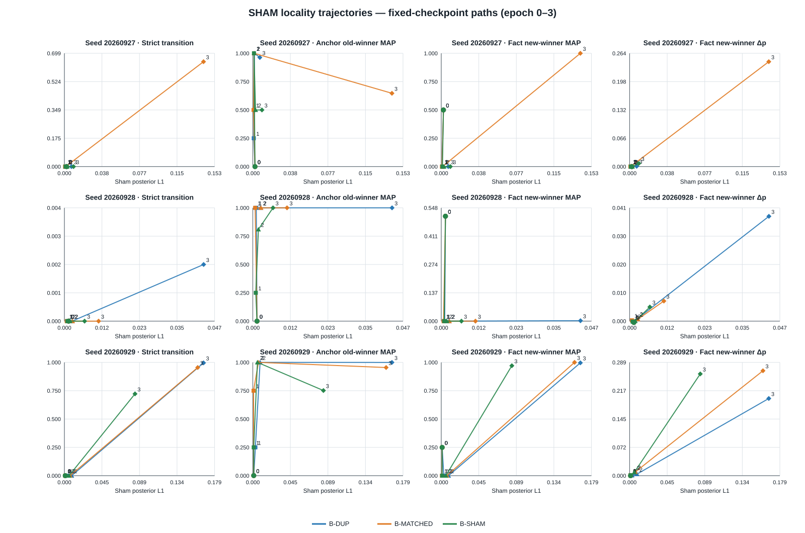
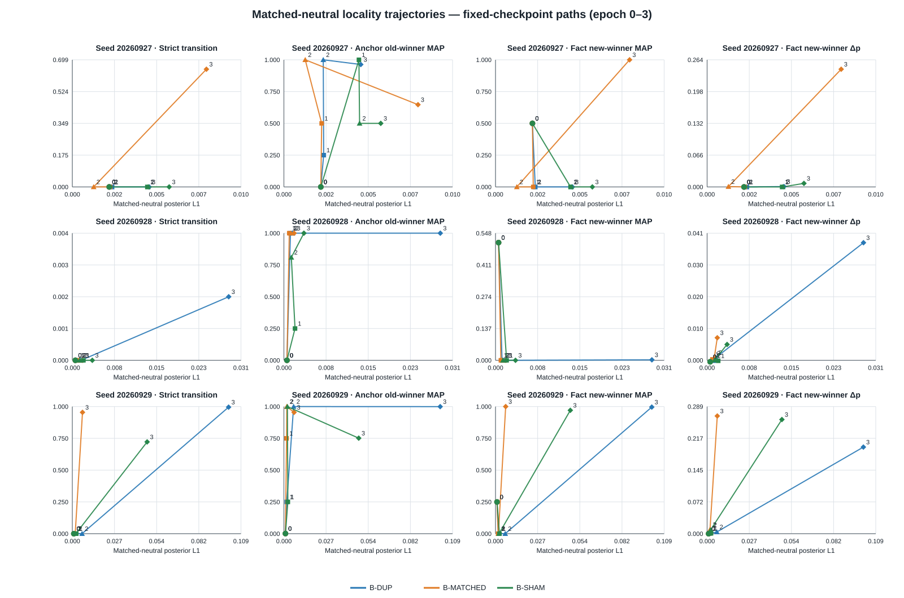

# JEV v0.8O — Capability Trajectory Cartography

**Identity:** post-hoc trajectory evaluation of all sealed v0.8N Phase-B checkpoints.

**Disposition:** complete and sealed; descriptive only.

**Original v0.8N Phase B:** remains `EVALUATION_INPUT_CONTRACT_INCOMPLETE`.
**v0.8N-E1:** remains the separately post-registered terminal evaluation; unchanged.

## Finding

The sealed trajectories show three distinct terminal response modes, not one scalar “sensitivity” failure:

- **Seed 20260927 — fact-response collapse under SHAM.** MATCHED develops a 64.70% strict old-to-new transition at epoch 3; SHAM has 0%. Mean fact-winner probability movement is `0.244583` under MATCHED versus `0.007380` under SHAM. At the same time, SHAM sham L1 is lower (`0.009309` vs `0.142067`).
- **Seed 20260928 — low-response basin.** Strict transitions remain 0% for both MATCHED and SHAM at every trained epoch. At epoch 3 both have 100% correct fact-direction sign, but mean new-winner movement is only `0.007199` and `0.005062`, respectively; neither crosses the strict MAP-transition criterion.
- **Seed 20260929 — anchor-boundary reallocation.** At epoch 3 SHAM retains a large fact response (`Δp=0.259618`, fact-view new-winner MAP `97.05%`) but anchor old-winner MAP falls to `75.15%`. The strict transition is `72.20%`, versus `95.45%` under MATCHED. SHAM locality improves on its own axis (sham L1 `0.083965` vs `0.158544`) while its matched-neutral L1 worsens (`0.048318` vs `0.006572`).

Thus the trajectory audit refines the terminal reading: the SHAM training effect is associated with lower response to the sham view, but its coupling to fact behavior differs by seed—near-collapse, low response, or loss of anchor-boundary preservation. This is descriptive evidence about the **learned decision heads** on the sealed held-out object, not a change to the frozen backbone and not a mechanism identification.

## Scope and procedure

All 27 sealed epoch checkpoints (three arms × three seeds × epochs 1–3) and the three shared seed initializations (epoch-0 baselines, repeated for each arm) were evaluated: 36 arm/seed/epoch cells, 2,000 held-out neighborhoods per cell, four views per neighborhood, 288,000 raw prediction rows total. All raw predictions were sealed before trajectory metrics were computed. A metadata-only audit then verified all 36 cell-to-checkpoint hashes, 2,000 common neighborhood IDs per cell, and exactly one each of anchor, fact-flip, sham, and matched-neutral views.

There was no training, checkpoint selection, head promotion, NewTight or legacy evaluation, or Phoenix access. No epoch is proposed as an alternate operating point. The post-seal reporting correction only added the contract-required epoch-0 null update-cosine entries; it did not change predictions, metrics, or metric definitions.

The full response matrix retains all three arms, all epochs, and all four families. These figures show separate capability coordinates; lines connect the fixed epochs and do not imply that a checkpoint was selected.

## Measured response trajectory

Epoch 0 is the shared initialization within each seed, so the three arms have identical predictions there. The initialization values are:

| Seed | Sham L1 | Matched L1 | Anchor old MAP | Fact new MAP | Strict transition | Fact new-winner Δp |
|---:|---:|---:|---:|---:|---:|---:|
| 20260927 | 0.002225 | 0.002136 | 0.0000 | 0.5000 | 0.0000 | -0.000076 |
| 20260928 | 0.001302 | 0.000554 | 0.0000 | 0.5075 | 0.0000 | -0.000469 |
| 20260929 | 0.001087 | 0.000984 | 0.0010 | 0.2495 | 0.0000 | -0.000006 |

The table below gives all 27 trained checkpoint cells. L1 values are mean posterior L1 drift on the indicated held-out perturbation. MAP and transition fields are proportions; `Δp` is mean fact-view new-winner probability movement.

| Seed | Epoch | Arm | Sham L1 | Matched L1 | Anchor old MAP | Fact new MAP | Strict | Fact Δp |
|---:|---:|---|---:|---:|---:|---:|---:|---:|
| 20260927 | 1 | DUP | 0.000957 | 0.002301 | 0.2500 | 0.0000 | 0.0000 | -0.000094 |
| 20260927 | 1 | MATCHED | 0.000746 | 0.002184 | 0.5000 | 0.0000 | 0.0000 | 0.000008 |
| 20260927 | 1 | SHAM | 0.001185 | 0.004341 | 1.0000 | 0.0000 | 0.0000 | 0.000030 |
| 20260927 | 2 | DUP | 0.001665 | 0.002276 | 1.0000 | 0.0000 | 0.0000 | 0.000035 |
| 20260927 | 2 | MATCHED | 0.001271 | 0.001234 | 1.0000 | 0.0000 | 0.0000 | 0.000664 |
| 20260927 | 2 | SHAM | 0.002793 | 0.004378 | 0.5000 | 0.0000 | 0.0000 | 0.000114 |
| 20260927 | 3 | DUP | 0.007145 | 0.004448 | 0.9630 | 0.0000 | 0.0000 | 0.000768 |
| 20260927 | 3 | MATCHED | 0.142067 | 0.007758 | 0.6470 | 1.0000 | 0.6470 | 0.244583 |
| 20260927 | 3 | SHAM | 0.009309 | 0.005603 | 0.5000 | 0.0000 | 0.0000 | 0.007380 |
| 20260928 | 1 | DUP | 0.001068 | 0.001182 | 1.0000 | 0.0000 | 0.0000 | -0.000135 |
| 20260928 | 1 | MATCHED | 0.000721 | 0.000974 | 1.0000 | 0.0000 | 0.0000 | 0.000280 |
| 20260928 | 1 | SHAM | 0.000920 | 0.002012 | 0.2500 | 0.0000 | 0.0000 | -0.000160 |
| 20260928 | 2 | DUP | 0.002365 | 0.001573 | 1.0000 | 0.0000 | 0.0000 | 0.000864 |
| 20260928 | 2 | MATCHED | 0.002527 | 0.001285 | 1.0000 | 0.0000 | 0.0000 | 0.000693 |
| 20260928 | 2 | SHAM | 0.001725 | 0.001343 | 0.8095 | 0.0000 | 0.0000 | 0.000057 |
| 20260928 | 3 | DUP | 0.043129 | 0.028322 | 1.0000 | 0.0020 | 0.0020 | 0.037532 |
| 20260928 | 3 | MATCHED | 0.010591 | 0.001845 | 1.0000 | 0.0000 | 0.0000 | 0.007199 |
| 20260928 | 3 | SHAM | 0.006254 | 0.003620 | 1.0000 | 0.0000 | 0.0000 | 0.005062 |
| 20260929 | 1 | DUP | 0.003048 | 0.001851 | 0.2500 | 0.0000 | 0.0000 | 0.000670 |
| 20260929 | 1 | MATCHED | 0.000862 | 0.001710 | 0.7500 | 0.0000 | 0.0000 | 0.000853 |
| 20260929 | 1 | SHAM | 0.001068 | 0.002548 | 0.2500 | 0.0000 | 0.0000 | 0.000815 |
| 20260929 | 2 | DUP | 0.008634 | 0.006272 | 1.0000 | 0.0000 | 0.0000 | 0.003968 |
| 20260929 | 2 | MATCHED | 0.006695 | 0.001873 | 1.0000 | 0.0000 | 0.0000 | 0.009425 |
| 20260929 | 2 | SHAM | 0.005480 | 0.002254 | 1.0000 | 0.0000 | 0.0000 | 0.008578 |
| 20260929 | 3 | DUP | 0.165465 | 0.100929 | 0.9995 | 0.9960 | 0.9955 | 0.196950 |
| 20260929 | 3 | MATCHED | 0.158544 | 0.006572 | 0.9545 | 1.0000 | 0.9545 | 0.267683 |
| 20260929 | 3 | SHAM | 0.083965 | 0.048318 | 0.7515 | 0.9705 | 0.7220 | 0.259618 |

## Terminal transition decomposition

Each row partitions the held-out neighborhoods into `A∧F`, `A∧¬F`, `¬A∧F`, `¬A∧¬F`, where A means the anchor retains its old MAP winner and F means the fact view has the new MAP winner. Entries are proportions.

| Seed | Arm | A∧F | A∧¬F | ¬A∧F | ¬A∧¬F |
|---:|---|---:|---:|---:|---:|
| 20260927 | MATCHED | 0.6470 | 0.0000 | 0.3530 | 0.0000 |
| 20260927 | SHAM | 0.0000 | 0.5000 | 0.0000 | 0.5000 |
| 20260928 | MATCHED | 0.0000 | 1.0000 | 0.0000 | 0.0000 |
| 20260928 | SHAM | 0.0000 | 1.0000 | 0.0000 | 0.0000 |
| 20260929 | MATCHED | 0.9545 | 0.0000 | 0.0455 | 0.0000 |
| 20260929 | SHAM | 0.7220 | 0.0295 | 0.2485 | 0.0000 |

This makes the seed-29 distinction explicit: most of its SHAM strict-transition loss is in `¬A∧F` (the fact view still reaches the new winner, but the anchor no longer retains the old winner), not in a complete loss of fact-view response.

## Family-specific terminal pattern: seed 20260929

| Family | MATCHED A-old | MATCHED F-new | MATCHED strict | SHAM A-old | SHAM F-new | SHAM strict |
|---|---:|---:|---:|---:|---:|---:|
| Exposure control | 1.000 | 1.000 | 1.000 | 0.998 | 1.000 | 0.998 |
| Respiratory monitoring | 1.000 | 1.000 | 1.000 | 1.000 | 1.000 | 1.000 |
| Salinity control | 1.000 | 1.000 | 1.000 | 1.000 | 0.882 | 0.882 |
| Vibration monitoring | 0.818 | 1.000 | 0.818 | 0.008 | 1.000 | 0.008 |

Vibration is the clearest anchor-preservation failure in this seed: the SHAM-trained head still selects the fact-view new winner for all vibration neighborhoods, while anchor old-winner preservation falls to `0.8%`. Family breakdowns are descriptive and do not establish a family-specific causal mechanism.

## Parameter-space trajectory

`‖Δφ‖₂` is the float64 parameter displacement from each seed’s shared initialization. Cosine is between the MATCHED and SHAM update vectors from that initialization. These are head-space descriptions only.

| Seed | Epoch | DUP ‖Δφ‖₂ | MATCHED ‖Δφ‖₂ | SHAM ‖Δφ‖₂ | cos(MATCHED, SHAM) |
|---:|---:|---:|---:|---:|---:|
| 20260927 | 1 | 5.77396 | 6.02778 | 5.71648 | 0.44280 |
| 20260927 | 2 | 5.81572 | 6.06048 | 5.83045 | 0.41870 |
| 20260927 | 3 | 5.92050 | 6.55075 | 6.10869 | 0.37590 |
| 20260928 | 1 | 5.19172 | 5.71638 | 5.53326 | 0.47268 |
| 20260928 | 2 | 5.27413 | 5.86545 | 5.67106 | 0.45030 |
| 20260928 | 3 | 5.71195 | 6.00444 | 5.82132 | 0.42952 |
| 20260929 | 1 | 5.62083 | 5.61874 | 5.56257 | 0.67550 |
| 20260929 | 2 | 5.77044 | 5.81863 | 5.71215 | 0.65535 |
| 20260929 | 3 | 6.63011 | 6.62806 | 6.46146 | 0.58944 |

In seed 20260929, terminal MATCHED and SHAM update norms are close (`6.62806` vs `6.46146`) despite different anchor/fact transition partitions. This is compatible with orientation or feature interactions mattering, but parameter norms/cosines do not identify that explanation.

## Interpretation boundary

This is a descriptive map of the already-sealed optimization paths on one repaired held-out object. It supports saying that the terminal behaviors emerge differently across seeds and that seed 20260929's strict-transition loss is predominantly anchor-preservation loss. It does **not** show that an earlier epoch is a valid operating point, identify a training-dynamics mechanism, or establish that semantic identity or representation direction caused the residual.

Rates are reported by fixed neighborhood and optimizer seed; no pooled significance test or composite score is used. The full machine-readable arm × seed × epoch matrix, all family-level panels, paired SHAM−MATCHED differences, and per-tensor parameter paths are in the sealed output below.

## Provenance

- Opening count: `3` (the original failed opening, the separate E1 evaluation, then this post-hoc O opening).
- Raw predictions: `288,000` rows; SHA-256 `cedce607c94497b5502c74f3da44a7d3b7c3fbe45b4a513d611cda6eed173888`.
- Final O result seal: SHA-256 `6327e2c3e83bbff7d511c5ba4bfd09792d5adad6aa95ae4d2abfce351e224ff7`.
- E1 parent result seal: `a23b3a6dc90a739888ae8d1cab440ac6c8f6ed23dd12b26c1bfd7786cd56ce68`.
- Sealed machine report and complete artifact tree: `D:\codex-runs\jev-information-density-v08o\v0.8O-capability-trajectory-cartography-v01`.
